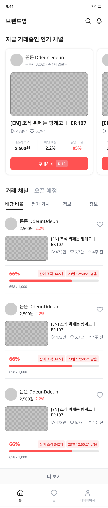

# 프론트엔드 문서 인덱스

Pencil 디자인 파일 기준 생성일: 2026-05-19

| 썸네일 | 페이지 | 라우트 | 비고 |
|---|---|---|---|
|  | [홈 화면](홈-화면.md) | `/` | 거래 채널 / 오픈 예정 탭 분리 |
|  | [채널 상세](채널-상세.md) | `/channels/:id` | 조각정보 / 가치평가 / 수익 구조 탭 |
|  | [거래 패널](거래-패널.md) | `/channels/:id/purchase` | 모달/패널 형식 |
|  | [구매 완료](구매-완료.md) | `/purchase/success` | 결제 후 성공 화면 |
|  | [투자자 마이페이지](투자자-마이페이지.md) | `/mypage` | 보유 자산 현황 대시보드 |
