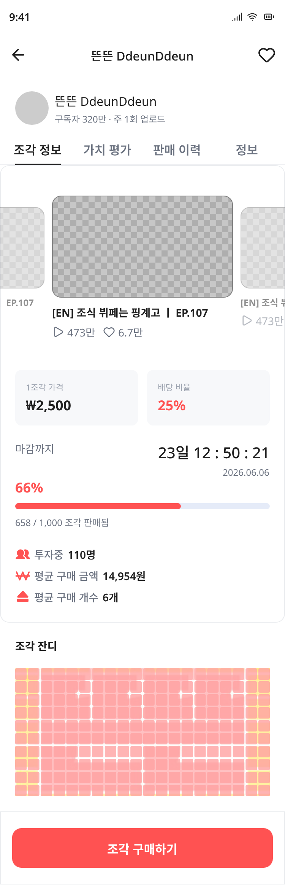

# 프론트엔드 문서 인덱스

Pencil 디자인 파일 기준 생성일: 2026-05-18

## 투자자 플로우 (Investor Flow)

| 화면 | 페이지명 | 라우트 | 설명 |
|---|---|---|---|
|  | [SCR-I001 채널 리스트 (카로셀)](SCR-I001-채널-리스트-카로셀.md) | `/channels` | 현재 거래 중인 채널 목록 및 카테고리 필터 |
|  | [SCR-I002 채널 상세](SCR-I002-채널-상세.md) | `/channels/:id` | 채널 상세 정보 및 판매 진행률, 투자자 통계 |
| — | SCR-I003 거래 패널 | `/transaction` | 채널 조각 구매 패널 |
| — | SCR-I005 구매 완료 | `/purchase-complete` | 구매 완료 화면 |
| — | SCR-I007 투자자 마이페이지 | `/mypage` | 투자자 정보 및 보유 자산 |

## 크리에이터 플로우 (Creator Flow)

| 화면 | 페이지명 | 라우트 | 설명 |
|---|---|---|---|
| — | SCR-C001 채널 연결 | `/creator/connect-channel` | YouTube 채널 연결 |
| — | SCR-C002 채널 정보 확인 | `/creator/channel-info` | 연결된 채널 정보 검증 |
| — | SCR-C003 심사 대기 | `/creator/review-pending` | 심사 대기 화면 |
| — | SCR-C004 심사 승인 | `/creator/review-approved` | 심사 승인 화면 |
| — | SCR-C006 조각 판매 설정 | `/creator/sale-settings` | 조각 판매 조건 설정 |
| — | SCR-C007 판매 등록 완료 | `/creator/registration-complete` | 판매 등록 완료 |

## 온보딩 플로우 (Common Auth Flow)

| 화면 | 페이지명 | 라우트 | 설명 |
|---|---|---|---|
| — | SCR-CM001 서비스 지정 | `/onboarding` | 서비스 선택 (투자자/크리에이터) |
| — | SCR-CM002 로그인 | `/login` | 이메일/비밀번호 로그인 |
| — | SCR-CM003 회원가입 - 이메일 | `/signup/email` | 회원가입 이메일 입력 |
| — | SCR-CM003-2 회원가입 - 인증 | `/signup/verify` | 이메일 인증 |
| — | SCR-CM003-3 회원가입 - 비밀번호 | `/signup/password` | 비밀번호 설정 |
| — | SCR-CM004 계정 유형 선택 | `/signup/account-type` | 투자자/크리에이터 유형 선택 |

## 디자인 시스템

- [디자인 토큰](../design-tokens.md) — 색상, 타이포그래피, 간격 정의
- [컴포넌트 라이브러리](../components.md) — 재사용 가능한 UI 컴포넌트

---

## 문서 작성 진행 상황

- [x] SCR-I001 채널 리스트 (카로셀) — 완료 (2026-05-17)
- [x] SCR-I002 채널 상세 — 완료 (2026-05-18)
- [ ] SCR-I003 거래 패널 — 예정
- [ ] SCR-I005 구매 완료 — 예정
- [ ] SCR-I007 투자자 마이페이지 — 예정
- [ ] SCR-C001~C007 크리에이터 플로우 — 예정
- [ ] 온보딩 플로우 — 예정

---

## 각 문서의 구조

각 화면 문서는 다음을 포함합니다:

- **디자인 캡처**: 스크린샷 및 주요 상태 변형
- **개요**: 라우트, 사용자 목표, 인증 여부
- **레이아웃**: 구조, 그리드, 간격, 반응형 동작
- **컴포넌트**: 페이지에 포함된 모든 UI 컴포넌트 상세 분석
- **상태(States)**: 기본, 로딩, 빈 상태, 에러, 인터랙션 상태
- **인터랙션 & 화면 흐름**: 사용자 행동과 화면 이동 흐름
- **디자인 토큰**: 색상, 타이포그래피, 간격, 보더 반지름, 그림자
- **개발자 참고사항**: 구현 시 주의사항, 미해결 요소
