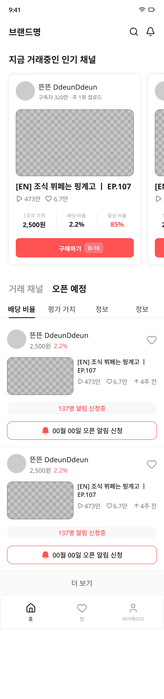

# 홈 화면 (SCR-I001 채널 리스트)

> 사용자가 현재 거래 중인 인기 채널과 곧 오픈될 예정인 채널을 탭으로 전환하며 탐색할 수 있는 메인 홈 페이지입니다.

---

## 디자인 캡처

### 거래 채널 탭


### 오픈 예정 탭


---

## 개요

- **라우트**: `/` (홈)
- **사용자 목표**: 현재 거래 중인 채널 확인 또는 곧 오픈될 채널 미리보기
- **인증 필요**: 예

---

## 레이아웃

### 구조
- **상단 고정 헤더**: 시간 표시, 브랜드명, 검색/알림 아이콘
- **타이틀 섹션**: "지금 거래중인 인기 채널" 
- **캐러셀**: 5개의 채널 카드 (좌우 스크롤 가능)
- **탭 네비게이션**: "거래 채널" / "오픈 예정" 두 개 탭
- **동적 콘텐츠 영역**: 선택된 탭에 따라 다른 채널 리스트 표시
- **하단 네비게이션**: 고정 탭바 (홈, 찜, 마이페이지)

### 뷰포트
- **폭**: 375px (모바일)
- **높이**: 
  - 거래 채널 탭: 1752px
  - 오픈 예정 탭: 1591px

### 그리드 & 간격
- **패딩**: 기본 20px (좌우), 상단 헤더 56px
- **탭 높이**: 80px (하단 고정)
- **섹션 간격**: 10px

---

## 컴포넌트

### 1. 상태 바 (Status Bar)

- **위치**: 상단 최상단
- **높이**: 44px
- **콘텐츠**:
  - 좌측: 시간 (9:41) - Pretendard Variable, 14px, 600 weight
  - 우측: WiFi 및 배터리 아이콘 (각 16x16px)
- **배경색**: `$bg-secondary` (#F7F8FA)

### 2. 헤더 (Top Header)

- **위치**: 상단 (상태바 아래)
- **높이**: 56px
- **콘텐츠**:
  - 좌측: "브랜드명" - Pretendard Variable, 20px, bold
  - 우측: 검색 아이콘 + 알림 아이콘 (각 22x22px)
- **배경색**: `$bg-secondary`
- **패딩**: 20px

### 3. 섹션 타이틀

- **텍스트**: "지금 거래중인 인기 채널"
- **스타일**: Pretendard Variable, 20px, bold, `$text-primary`
- **패딩**: 20px (좌우), 0px (상단)

### 4. 캐러셀 (Carousel Container)

- **위치**: 타이틀 아래
- **콘텐츠**: 채널 카드 × 5개 (ref: `b9GQP`)
- **특징**:
  - 좌우 스크롤 가능 (clip: true)
  - 카드 간 간격: 16px
  - 패딩: 20px
  - 배경색: `$bg-secondary`

### 5. 탭 선택 (Tab Toggle)

**거래 채널 탭이 활성화된 상태 (TxKpr):**
- "거래 채널": `$text-primary` (검은색)
- "오픈 예정": `$text-tertiary` (회색)

**오픈 예정 탭이 활성화된 상태 (r6JXt):**
- "거래 채널": `$text-tertiary` (회색)
- "오픈 예정": `$text-primary` (검은색)

- **스타일**: Pretendard Variable, 20px, bold
- **간격**: 20px (탭 사이)
- **패딩**: 20px

### 6. 탭 내용 (Tab Content)

#### 6-1. 탭 버튼 그룹

- **위치**: 탭 선택 아래
- **콘텐츠**: 4개의 탭 버튼 (tap/on, tap/off × 3)
- **배치**: `space_between`
- **하단 보더**: 1px `$border`

#### 6-2. 채널 리스트

**거래 채널 탭 (TxKpr):**
- 3개의 채널 리스트 아이템 (ref: `J2iwSj` × 3)
- 각 아이템 높이: 294px
- 마지막에 "더보기" 버튼 (btn/ghost) - 높이 52px

**오픈 예정 탭 (r6JXt):**
- 2개의 채널 리스트 아이템 (ref: `j7b5TG` × 2)
- 각 아이템 높이: ~283px
- 마지막에 "더보기" 버튼 (btn/ghost)

- **레이아웃**: 수직 스택
- **배경색**: 투명

### 7. 하단 네비게이션 (Bottom Tab Bar)

- **위치**: 화면 최하단 (고정)
- **높이**: 80px
- **콘텐츠**: 3개 탭
  - 홈 (활성): 아이콘(house) + 텍스트 "홈", `$text-primary`
  - 찜 (비활성): 아이콘(heart) + 텍스트 "찜", `$text-tertiary`
  - 마이페이지 (비활성): 아이콘(user) + 텍스트 "마이페이지", `$text-tertiary`

- **스타일**:
  - 텍스트: Pretendard Variable, 11px, regular
  - 아이콘: 24x24px
  - 아이콘과 텍스트 간격: 4px

- **배경색**: `$bg-primary` (#FFFFFF)
- **상단 보더**: 1px `$border`
- **패딩**: 20px (상하), 12px (좌우)

---

## 상태(States)

| 상태 | 트리거 | 시각적 변화 |
|---|---|---|
| **기본** | 페이지 로드 | 거래 채널 탭 활성, 3개 리스트 표시 |
| **탭 전환** | "오픈 예정" 탭 클릭 | 오픈 예정 탭 활성, 2개 리스트 표시, 색상 반전 |
| **호버** | 리스트 아이템 마우스 오버 | <!-- TODO: 호버 상태 디자인 필요 --> |
| **더보기 클릭** | "더보기" 버튼 클릭 | <!-- TODO: 더 많은 채널 로드 / 목록 페이지로 이동 --> |
| **채널 카드 클릭** | 캐러셀 카드 클릭 | <!-- TODO: 채널 상세 화면으로 이동 --> |

---

## 인터랙션 & 화면 흐름

```
[페이지 진입] → [거래 채널 탭 기본 활성]
    ↓
[캐러셀 카드 클릭] → [채널 상세 화면 (SCR-I002) 이동]
    ↓
["오픈 예정" 탭 클릭] → [탭 전환, 리스트 업데이트]
    ↓
[리스트 아이템 클릭] → [채널 상세 화면으로 이동]
    ↓
["더보기" 버튼 클릭] → [전체 채널 목록으로 이동 (TBD)]
```

---

## 디자인 토큰

### 색상

| 토큰 | 값 | 용도 |
|---|---|---|
| `$bg-primary` | #FFFFFF | 메인 배경, 하단 네비게이션 |
| `$bg-secondary` | #F7F8FA | 헤더, 섹션 배경 |
| `$bg-tertiary` | #FAFAFA | 버튼 배경 |
| `$text-primary` | #1F1F1F | 활성 텍스트, 제목 |
| `$text-secondary` | #6B7280 | 보조 텍스트 |
| `$text-tertiary` | #9CA3AF | 비활성 텍스트, 아이콘 |
| `$border` | #EAECEF | 보더 라인 |

### 타이포그래피

| 역할 | 폰트 | 크기 | 굵기 | 행간 |
|---|---|---|---|---|
| 시간 표시 | Pretendard Variable | 14px | 600 (semibold) | — |
| 브랜드명 | Pretendard Variable | 20px | 700 (bold) | — |
| 섹션 타이틀 | Pretendard Variable | 20px | 700 (bold) | — |
| 탭 텍스트 | Pretendard Variable | 20px | 700 (bold) | — |
| 네비게이션 텍스트 | Pretendard Variable | 11px | 400 (regular) | — |

### 간격

| 토큰 | 값 | 용도 |
|---|---|---|
| `$spacing-xs` | 4px | 아이콘-텍스트 간격 |
| `$spacing-md` | 12px | 네비게이션 패딩 |
| `$spacing-lg` | 16px | 카드 간격 |
| `$spacing-xl` | 20px | 기본 패딩 |

### 반지름

| 토큰 | 값 |
|---|---|
| `$radius-lg` | 12px |

---

## 개발자 참고사항

### 탭 전환 로직
- TxKpr와 r6JXt는 동일한 구조이지만 **탭 활성 상태만 다릅니다**
- 거래 채널 탭: "거래 채널" 텍스트가 `$text-primary`, "오픈 예정"이 `$text-tertiary`
- 오픈 예정 탭: 반대로 색상 적용

### 리스트 차이점

**거래 채널 탭 (TxKpr):**
- `J2iwSj` 컴포넌트 사용
- 3개 아이템 표시

**오픈 예정 탭 (r6JXt):**
- `j7b5TG` 컴포넌트 사용 (다른 레이아웃)
- 2개 아이템 표시

### 캐러셀
- 2개의 채널 카드만 보임 (좌우 스크롤 가능)
- 디자인에서 스크롤 범위 확인 필요

### 버튼 상태
- "더보기" 버튼: `btn/ghost` 스타일
- 색상: `$bg-tertiary` (#FAFAFA)
- 높이: 52px

### 미확인 사항
- <!-- TODO: 탭 전환 시 애니메이션 있는지 확인 --> 없음
- <!-- TODO: 캐러셀 자동 스크롤 여부 확인 -->
- <!-- TODO: "더보기" 클릭 시 동작 확인 (페이지 이동 vs 인라인 로드) --> 페이지 이동. 채널 리스트 무한스크롤 페이지. 아직 미제작
- <!-- TODO: 네비게이션 탭바의 다른 탭 클릭 시 라우트 확인 -->
